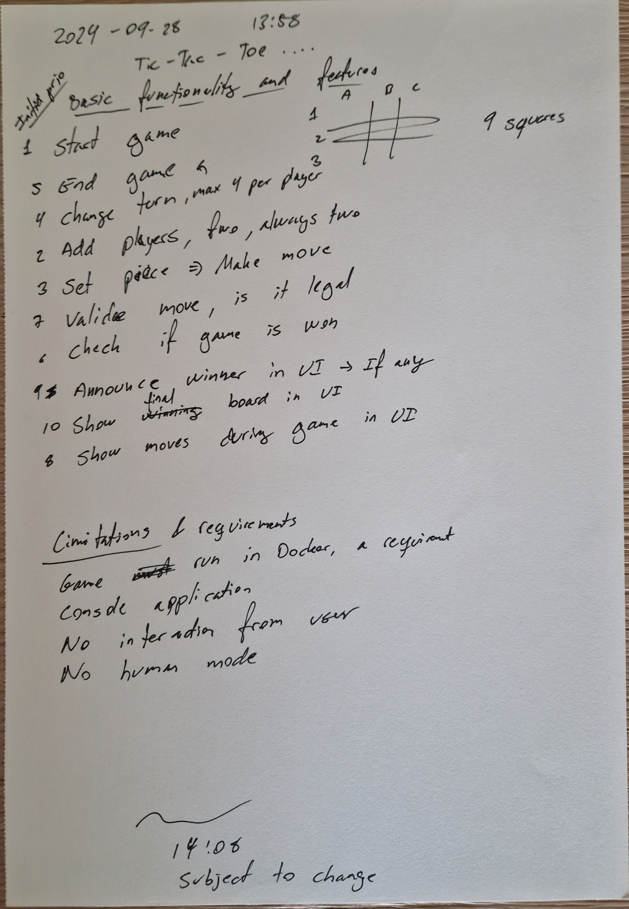

# Tic Tac Toe

Implementation of the game Tic Tac Toe following "modern softeware development" practics.

## Plan going forward

Thoughs while reading the instructions:

A frist sketch of a plan for the development:

Inital outline of functionality and features of the Tic Tac Toe game

## Time overview

This is roughy how long different elemants have taken so far
* Reading instructions and creating plan : 38 min
* Updating Readme with plan: 12 min