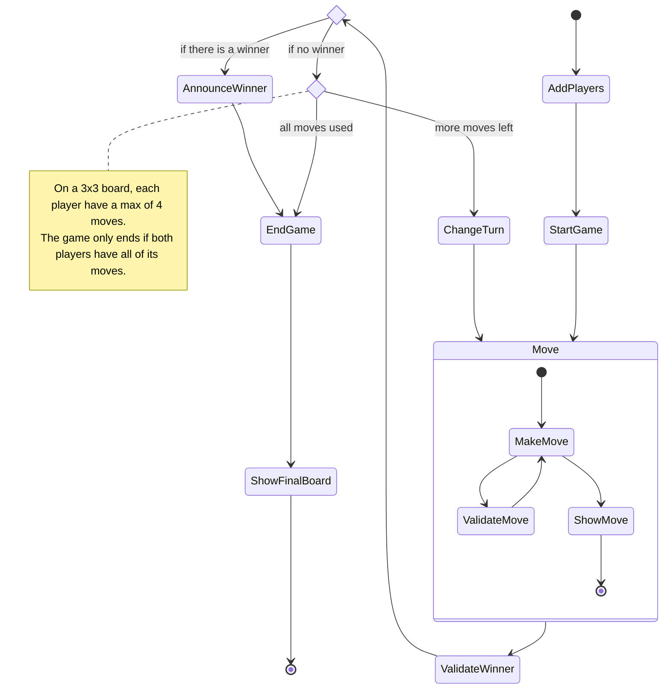

# Gameplay

State diagram of the gameplay in the Tic Tac Toe game

```mermaid
stateDiagram
    state if_winner <<choice>>
    state if_movelimit <<choice>>
    state Move {
        [*] --> MakeMove
        MakeMove --> ValidateMove
        ValidateMove --> MakeMove
        MakeMove --> ShowMove
        ShowMove --> [*]
    }

    note right of if_movelimit
        On a 3x3 board, each player have a max of 4 moves.
        The game only ends if both players have all of its moves.
    end note

    [*] --> AddPlayers
    AddPlayers --> StartGame
    StartGame --> Move
    
    ValidateWinner --> if_winner
    if_winner --> AnnounceWinner : if there is a winner
    if_winner --> if_movelimit : if no winner
    if_movelimit --> ChangeTurn : more moves left
    if_movelimit --> EndGame : all moves used
    ChangeTurn --> Move
    Move --> ValidateWinner
    AnnounceWinner --> EndGame
    EndGame --> ShowFinalBoard
    ShowFinalBoard --> [*]
    
```

